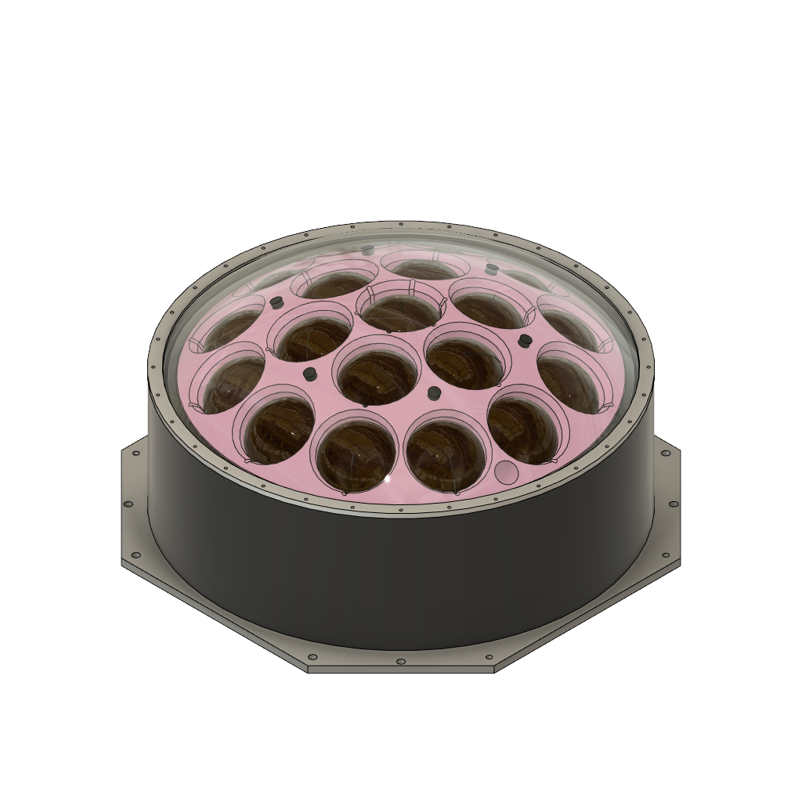

# mPMT Assembly v1 # 

**Model Source:** Designed by Nick Burrill\
**Last Update:** March 14th 2023\
**Aditional Notes:** Pink XPS Matrix, as built at Carleton. Initial commit to repo.

**Part Versions Used:**
* Acrylic Dome v1
* Aluminum Ring v1
* Back Plane v1
* Dome Standoff v1
* Pillar v1
* PMT Array v1
* PVC Cylinder v1
* Support Matrix v1