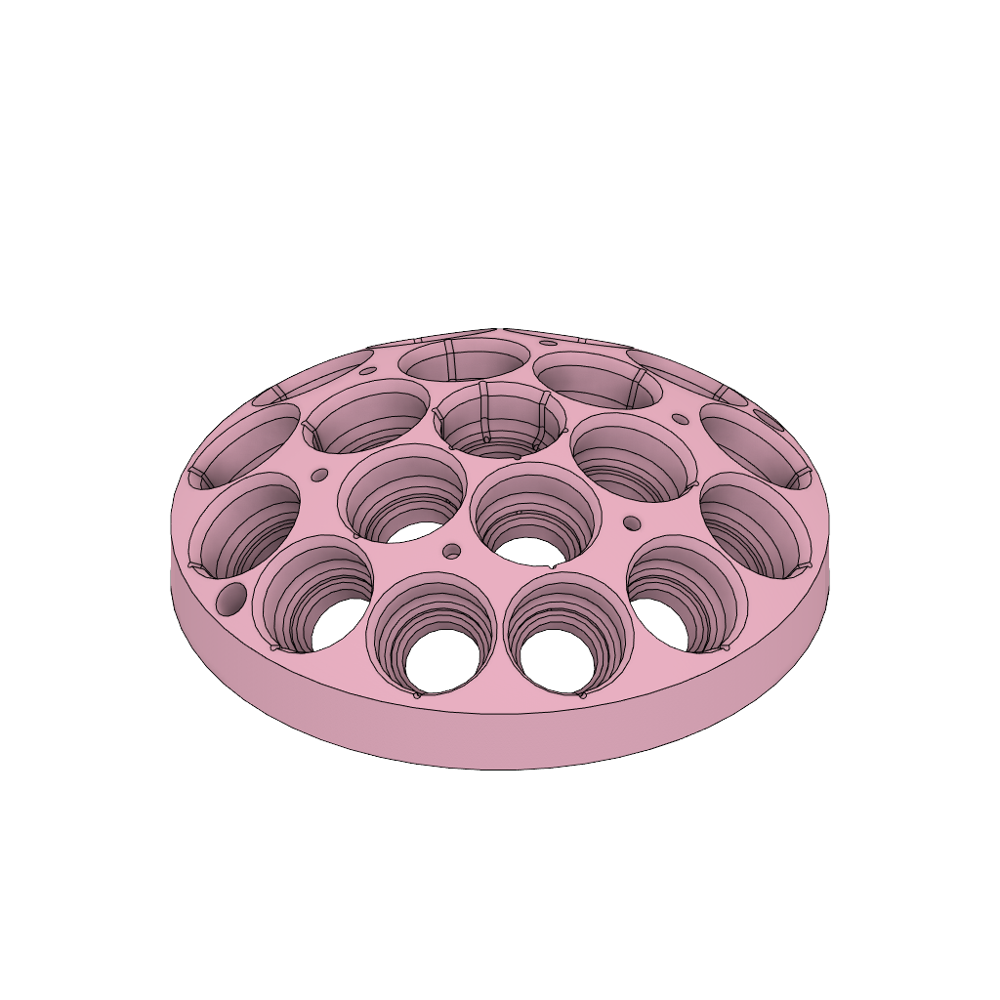

# Support Matrix v1 # 

**Model Source:** Designed by Nick Burrill \
**Part Source:** Machined at Capital Machining Services, Ottawa ON \
**Last Update:** November 25th 2022 \
**Material:** Laminated XPS foam, 3d printed ABS\
**Aditional Notes:** The crossing vent channels were not machinable but easy to manually add to the foam after. When 3d printing, the .stl file with cross channels was used.

In the current state of the .f3d file, the last four steps can be undone to supress the cross channels.
